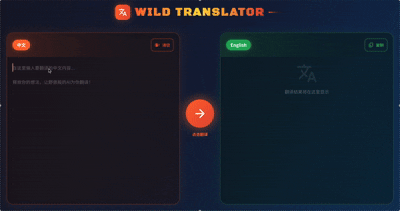
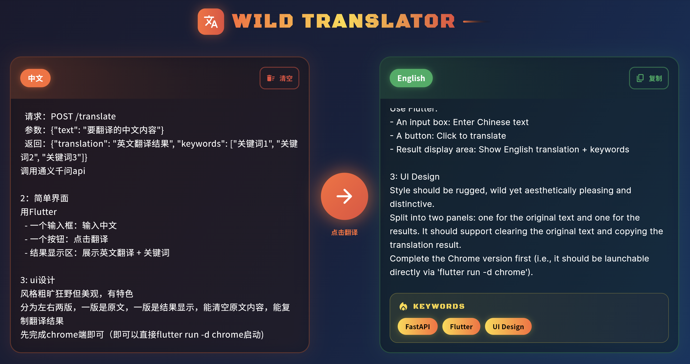

# AI翻译助手 - Wild Translator 🔥

<p align="center">
  <a>
    
  </a>
</p>

一个粗旷狂野风格的AI翻译助手，使用通义千问API进行中英翻译。


## 项目展示
<p align="center">
  
</p>

<p align="center">
  
</p>

## 项目结构

```
translator-opus/
├── backend/           # FastAPI后端
│   ├── main.py       # 主程序
│   ├── requirements.txt
│   └── .env.example  # 环境变量示例
└── frontend/          # Flutter前端
    └── translator_app/
```

## 快速开始

### 1. 配置后端

```bash
# 进入后端目录
cd backend

# 创建虚拟环境（推荐）
python3 -m venv venv
source venv/bin/activate

# 安装依赖
pip install -r requirements.txt

# 配置API密钥
cp .env.example .env
# 编辑 .env 文件，填入你的通义千问API密钥
# DASHSCOPE_API_KEY=your_api_key_here
```

### 2. 获取通义千问API密钥

1. 访问 [阿里云DashScope控制台](https://dashscope.console.aliyun.com/)
2. 注册/登录账号
3. 创建API Key
4. 将API Key填入 `backend/.env` 文件

### 3. 启动后端服务

```bash
cd backend
python main.py
```

后端服务将在 http://localhost:8000 运行

### 4. 启动前端

```bash
cd frontend/translator_app
flutter pub get
flutter run -d chrome
```

## API接口

### POST /translate

翻译中文到英文并提取关键词

**请求：**
```json
{
  "text": "要翻译的中文内容"
}
```

**响应：**
```json
{
  "translation": "English translation result",
  "keywords": ["keyword1", "keyword2", "keyword3"]
}
```

## 功能特点

- 🔥 粗旷狂野的UI设计风格
- 📝 左右分栏布局，原文和译文清晰对比
- 🗑️ 一键清空原文
- 📋 一键复制翻译结果
- 🏷️ 自动提取关键词
- ✨ 炫酷的动画效果

## 技术栈

- **后端**: Python + FastAPI + 通义千问API
- **前端**: Flutter Web
- **UI框架**: Material Design 3
- **字体**: Google Fonts (Black Ops One, Noto Sans SC)

## 开发说明

- 后端默认运行在 8000 端口
- 前端需要后端服务运行才能正常工作
- 确保已正确配置通义千问API密钥
